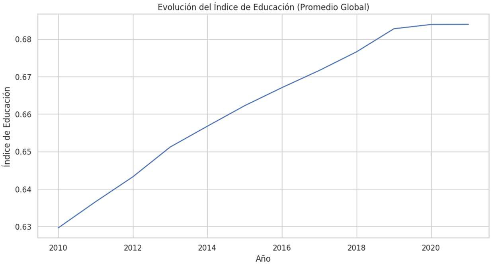
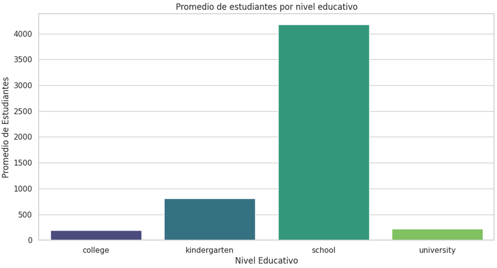
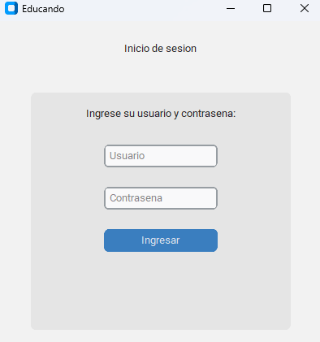
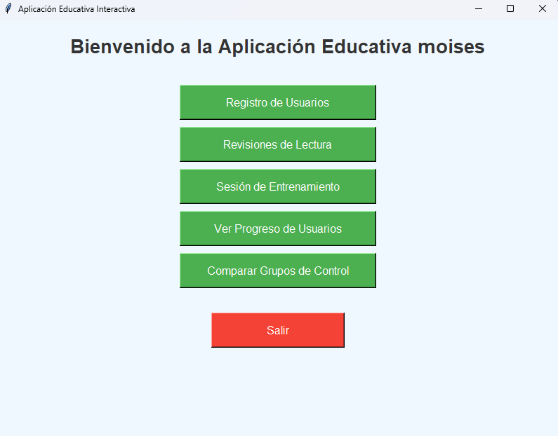
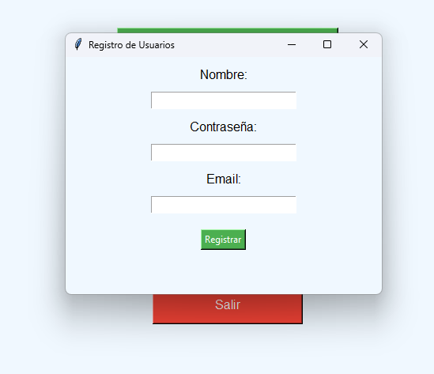
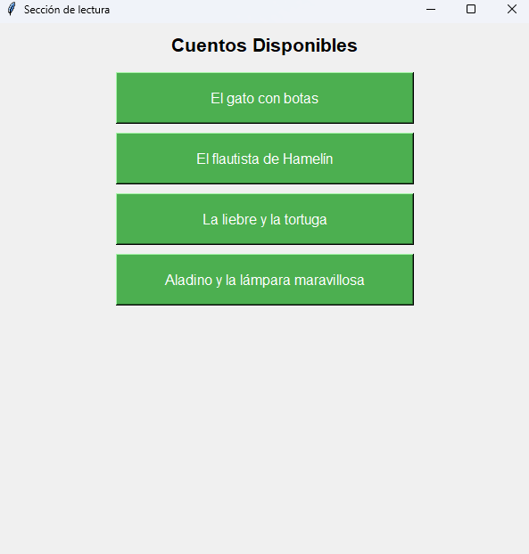
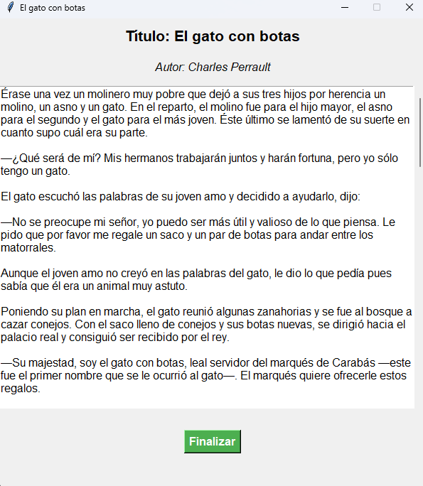
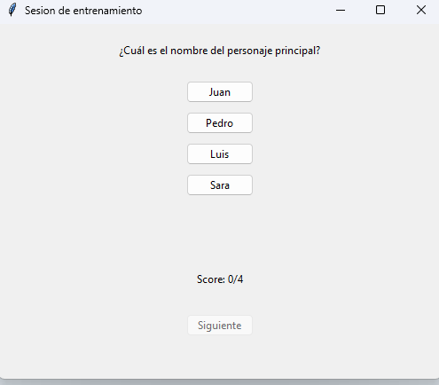
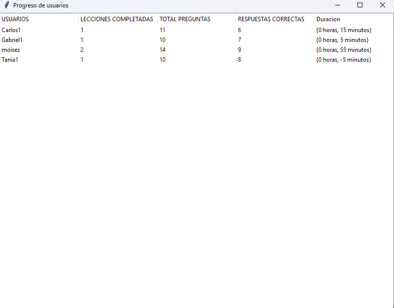
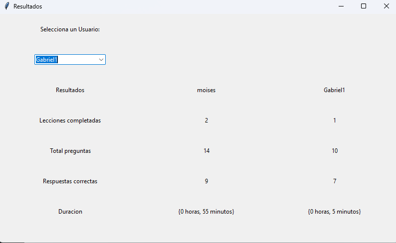

## Tabla de contenidos
Tabla de contenidos

1. [Nombre](#Nombre)
2. [Descripción](#descripción)
3. [Arquitectura](#Arquitectura)
4. [Proceso](#Proceso)
5. [Funcionalidades](#Funcionalidades)
6. [Estado del proyecto](#EstadoDelProyecto)
7. [Agradecimientos](#Agradecimientos)

<h1 style="text-align:center; color:#f7a325;">ProyectoEducando</h1>

Proyecto Samsung 2024
Objetivos: Diseñar un software en Python que permita aprender de forma interactiva con el uso del programa.

*	Desarrollar un software basado en Python, que permita mejorar el aprendizaje con el uso del programa.
*	El programa puede contar con una sección para permitir el registro de usuarios.
*	Puede contar con diferentes secciones: revisión de lecturas, sesión de entrenamiento, secciones de pruebas.
*	El software debe estar diseñado de tal forma que se registre el progreso de los usuarios.
*	Pruebas en grupos de control, realizar pruebas en dos grupos uno donde se muestre la forma tradicional de enseñanza es decir a través de lecturas y otro donde se muestren alternativas de enseñanza con el desarrollo de software. (registrar el tiempo de uso del programa en ambos grupos de control y luego comparar resultados, la sección de pruebas es opcional)

## Arquitectura

* Arquitectura del proyecto + imagen

* Proceso de desarrollo:

-Fuente del dataset

-Limpieza de datos (img que lo valide)

-Manejo excepciones/control errores

-Estadísticos (Valores, gráficos, …)
<!-- > [!NOTE]
> El proyecto se fundamenta en el analisis de datos y tambien en la implementacion de un software educativo que los estudiantes pueden optar para su rendimiento -->

  <strong >Indice de educación</strong>
   

  <strong >Descripción:</strong>
  
En la siguiente grafica se puede visualizar un primedio de estudiantes por niveles educativos

## Funcionalidad extra:

## Integración del proyecto en una aplicacion web

  
Se desarrollo una interfaz amigable donde los estudiantes pueden poner en practica sus capacidades de lectura

 
Tenemos la primer ventana que consta de Validacion de usuarios

 

 
Ventana Principal donde se podra elegir la opcion a realizar con sus respectivas validaciones

 

 
Opcion de agregar nuevos usuarios

 

 
Seccion de Revisiones de lectura donde podra seleccionar la que guste leer

 
Contenido de la lectura elegida

 

 
Seccion de Entrenamiento

 

 
Seccion de progreso de usuario

 

 
Seccion de comparacion entre usuarios

 

## Tecnología /Herramientas usadas para el software
* Base de datos Relacion (SQL SERVER)
* Lenguaje de consultas SQL

## EJECUTABLE DEL SOFTWARE

> [!NOTE]
> crear .exe del programa

> [!IMPORTANT]
> Instalar la siguiente libreria
> pip install pyinstaller

> [!IMPORTANT]
> comando para crear el empaquetado de los archivos
> pyinstaller --onefile --windowed --add-data "cuentos;cuentos" login.py
